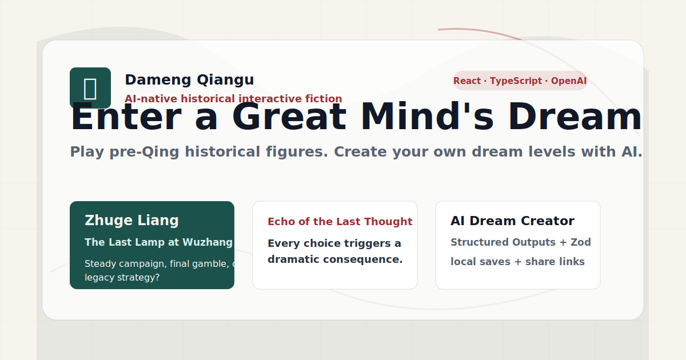

# 大梦千古

[English](README.md) | [简体中文](README.zh-CN.md)

[](https://github.com/study8677/dameng-qiangu/actions/workflows/deploy.yml)
[](https://github.com/study8677/dameng-qiangu/actions/workflows/ci.yml)


**AI 原生历史互动叙事游戏。** 玩家进入清朝以前伟大历史人物的关键一梦，通过选择改变智慧、胆识、心性、声望、天命偏差，并打出不同结局；用户也可以选择官方人物，或自定义清朝以前历史人物，再用 AI 制作自己的梦境，用链接分享给别人玩。

[在线试玩](https://study8677.github.io/dameng-qiangu/) · [架构说明](docs/ARCHITECTURE.md) · [路线图](docs/ROADMAP.md)



## 这个项目的亮点

很多 AI 叙事产品像聊天，规则不稳定；很多互动小说工具又需要大量手工编排。**大梦千古**把两者拆开：

- AI 只生成结构化 `DreamLevel` 数据，不生成代码。
- 游戏引擎负责节点、选项、数值、结局和分享。
- 官方梦境手写，没配置 AI 后端也能完整游玩。
- 用户生成内容默认保存在本机 `localStorage`，不需要账号和数据库。
- 分享链接直接携带压缩后的梦境 JSON，别人打开就能玩。
- 主题聚焦清朝以前伟大历史人物，不做泛题材扩散。

## MVP 玩法

首批精做 6 个官方梦境：

| 人物 | 朝代 | 官方梦境 |
| --- | --- | --- |
| 孔子 | 春秋 | 《杏坛问礼》 |
| 屈原 | 战国 | 《汨罗醒魂》 |
| 诸葛亮 | 三国 | 《五丈原最后一盏灯》 |
| 李白 | 唐 | 《长安醉月》 |
| 岳飞 | 宋 | 《风波铁马》 |
| 王阳明 | 明 | 《龙场心灯》 |

每个梦境包含 5-7 个节点、每个节点 2-4 个选择、五维数值变化、至少 3 个可达结局。当前版本还加入了 **“上一念回响”**：每次选择后，玩家会立即看到这次抉择造成的戏剧性后果；结局页也会把整条选择轨迹串起来，让不同路线更有分支感。

## AI 制作梦境

用户可以选择官方人物，也可以自定义清朝以前历史人物，再填写主题、风格、长度和补充设定，让 AI 生成一个可玩的梦境关卡。前端会用 Zod 校验返回结构，校验通过后才保存到本机。

AI 生成被限制为：

- 清朝以前历史人物梦境；
- 官方人物或自定义历史人物；
- 严格结构化 `DreamLevel` JSON；
- 可游玩的节点、选项、数值和结局；
- 只生成旁白、史官点评、结局文案，不生成可执行代码。

如果没有配置 AI 代理，官方梦境和本地样例仍然可以正常游玩。

## 技术栈

- **前端：** Vite、React、TypeScript、Tailwind CSS
- **数据校验：** Zod
- **分享：** `lz-string` 压缩 URL hash
- **AI 代理：** Vercel Serverless Function + OpenAI Responses API Structured Outputs
- **测试：** Vitest、Playwright
- **部署：** GitHub Pages

## 本地启动

```bash
npm install
npm run dev
```

常用检查：

```bash
npm run build
npm run test
npm run lint
npm run test:e2e
```

## AI 代理配置

前端不会保存 OpenAI API Key。请把 `api/generate-dream.ts` 部署到 Vercel，并配置服务端环境变量：

```bash
OPENAI_API_KEY=your_openai_key
OPENAI_MODEL=gpt-4o-mini
ALLOWED_ORIGIN=https://your-github-username.github.io
```

然后在前端配置：

```bash
VITE_AI_PROXY_URL=https://your-vercel-project.vercel.app/api/generate-dream
```

如果部署到 GitHub Pages，可以把 `VITE_AI_PROXY_URL` 加到 GitHub 仓库变量里，让 Pages workflow 在构建时注入。

## 项目结构

```text
api/generate-dream.ts        # Vercel AI 代理
public/covers/               # 官方人物封面 SVG
src/App.tsx                  # Hash 路由与页面
src/data/dreams.ts           # 官方梦境数据
src/data/figures.ts          # 历史人物目录
src/lib/game.ts              # 确定性游戏引擎
src/lib/schemas.ts           # Zod 数据契约
src/lib/share.ts             # 分享链接编码/解码
src/lib/storage.ts           # localStorage 保存
tests/unit/game.test.ts      # 引擎、schema、分享测试
tests/e2e/app.spec.ts        # 核心浏览器流程
```

## 路线图

- **V1：** Supabase 登录、公开梦境广场、点赞、收藏、审核状态。
- **V1.5：** 创作者主页、二创/改编、节点图编辑器、梦境质量评分。
- **V2：** 更多清朝以前人物、隐藏结局、成就系统、人物被动特质。
- **V3：** 创作者市场、商业化实验、完整审核后台。

## 参与贡献

适合贡献的方向：

- 新增清朝以前历史人物官方梦境；
- 优化移动端阅读体验；
- 增加梦境图结构边界校验；
- 扩展分享、制作、游玩的 Playwright 测试；
- 改进英文 README 与官方梦境翻译。

提交 PR 前请先阅读 [CONTRIBUTING.md](CONTRIBUTING.md)。

## 社区文件

- [路线图](docs/ROADMAP.md)
- [架构说明](docs/ARCHITECTURE.md)
- [更新日志](CHANGELOG.md)
- [安全策略](SECURITY.md)
- [行为准则](CODE_OF_CONDUCT.md)

## License

MIT. See [LICENSE](LICENSE).
